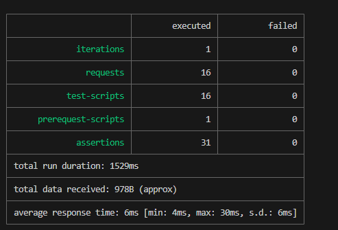
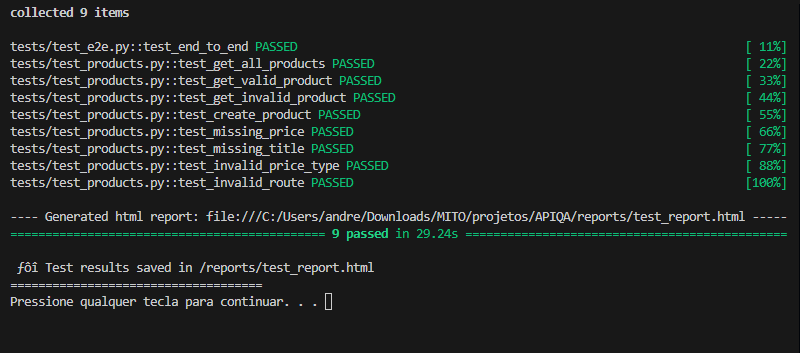

# Store API 

## Descrição
Este projeto é uma **API de produtos** desenvolvida com **FastAPI** para fins de estudo e prática de **Quality Assurance (QA)**. A API implementa um CRUD básico de produtos e está acompanhada de uma suíte de testes automatizados utilizando **PyTest** e **Newman (Postman CLI)**, com geração de relatórios em **HTML**.

---

## Endpoints da API

### Produtos
- **GET /products**  
  Retorna a lista de todos os produtos cadastrados.

- **GET /products/{id}**  
  Retorna um produto específico pelo seu `id`.  
  - Exemplo: `/products/1`

- **POST /products**  
  Cria um novo produto.  
  - Corpo da requisição (JSON):
    ```json
    {
      "title": "Tênis",
      "price": 200.0
    }
    ```

- **DELETE /products/{id}**  
  Remove um produto existente pelo seu `id`.  
  - Exemplo: `/products/2`


## Funcionalidades da API

- **GET /products**  
  Retorna a lista de todos os produtos cadastrados.

- **GET /products/{id}**  
  Retorna um produto específico pelo seu `id`.  
  - Exemplo: `/products/1`

- **POST /products**  
  Cria um novo produto.  
  - Corpo da requisição (JSON):
    ```json
    {
      "title": "Tênis",
      "price": 200.0
    }
    ```

- **DELETE /products/{id}**  
  Remove um produto existente pelo seu `id`.  
  - Exemplo: `/products/2`

## Testes implementados
- **Funcionais:** CRUD completo de produtos
- **Negativos:** Campos obrigatórios ausentes, tipos inválidos, rotas inexistentes
- **Contratos:** Validação de schema (id, title, price)
- **End-to-End (E2E):** Criação → Consulta → Listagem → Exclusão

### Newman:


### Pytest:


## Estrutura do projeto 
```bash

APIQA/
│── app/                # Código da API
│── tests/              # Testes automatizados (PyTest)
│── postman/            # Coleções Postman
│── reports/            # Relatórios HTML gerados
│── setup.bat           # Script para setup do ambiente
│── run_api.bat         # Script para subir a API
│── run_tests.bat       # Script para rodar testes PyTest
│── run_postman_test.bat# Script para rodar testes Newman
│── README.md           # Documentação do projeto
```


## Modelo de produto:
```json
{
  "id": 1,
  "title": "Camisa",
  "price": 50.0
}
```

## Como executar
⚠️ Observação: Os scripts `setup.bat` e `run_api.bat` foram criados para ambientes **Windows** e devem ser executados via **Prompt de Comando (CMD)**. Em sistemas Linux/Mac, será necessário adaptar os comandos para shell scripts (`.sh`).

### 1. Setup do ambiente(Windows CMD)
```bash
setup.bat
#Executa o Virtual environment do python para evitar conflitos de versões e libs
```

### 2. Subir a API
```bash
run_api.bat
#URL: http://localhost:8000/products
```

### 3. Rodar testes PyTest
```bash
run_tests.bat
#Relatório gerado em: reports/test_report.html
```

### 4. Rodar testes Postman (Newman)
```bash
run_postman_test.bat
#Relatório gerado em: postman/results/
```